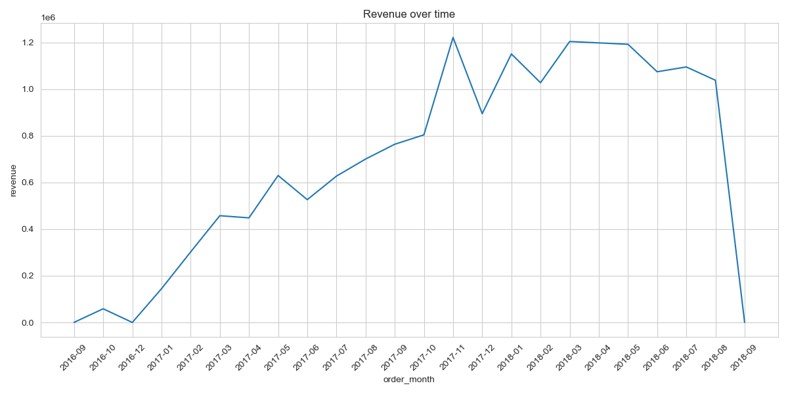
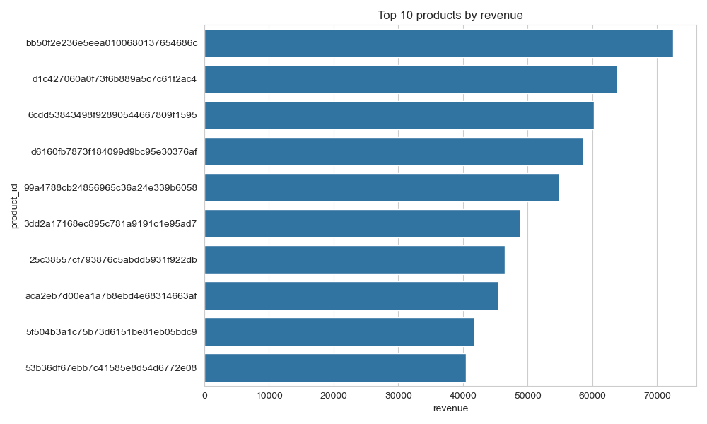
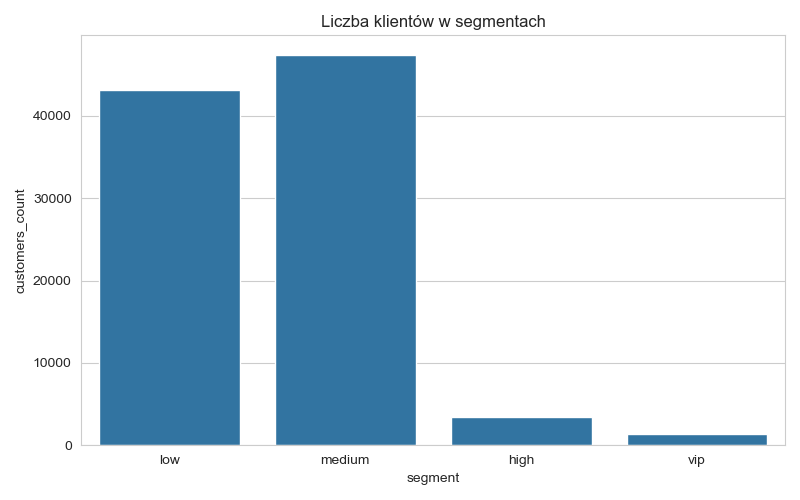
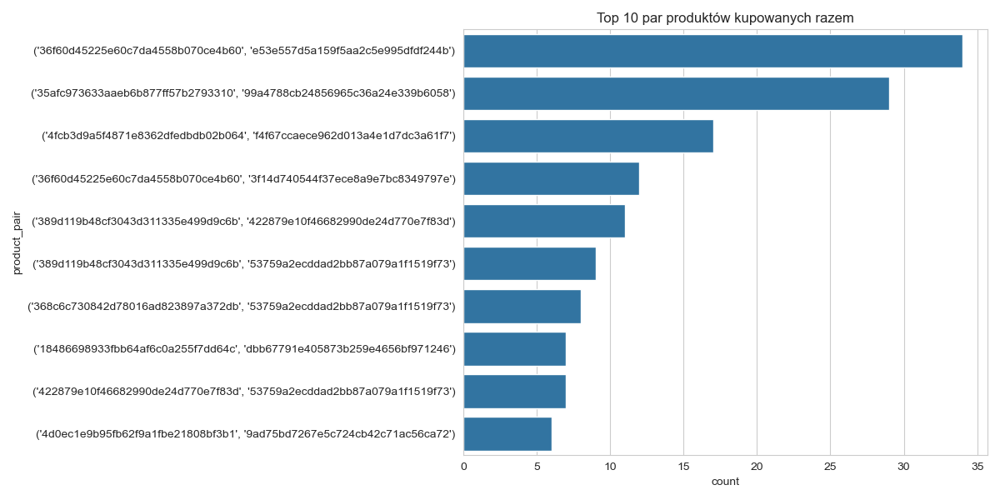
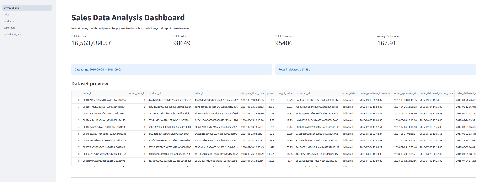
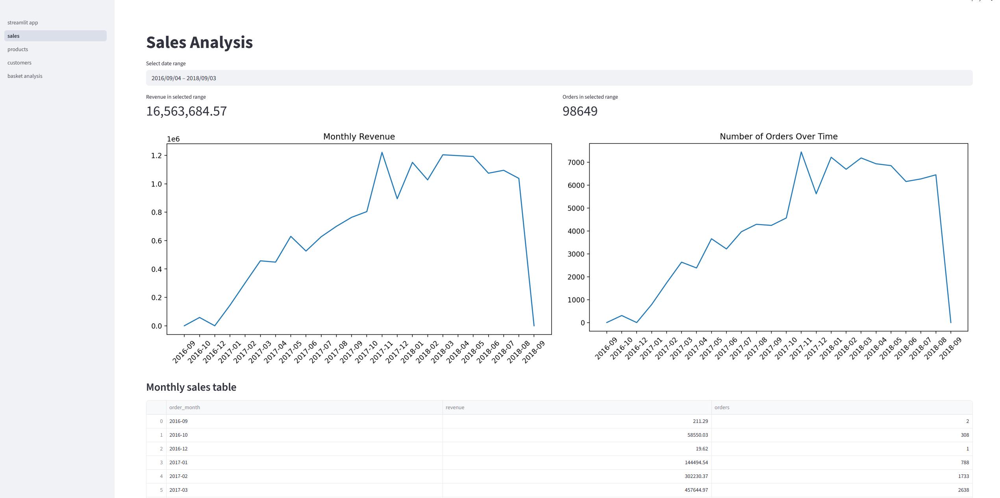
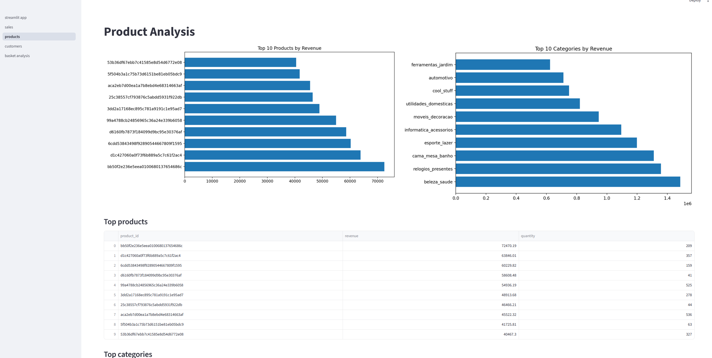

# Analiza danych sprzedażowych

## Opis projektu

Projekt przedstawia analizę danych sprzedażowych sklepu internetowego z wykorzystaniem publicznego datasetu e-commerce Olist.

Celem projektu było przeprowadzenie kompleksowej analizy danych sprzedażowych obejmującej:

* przygotowanie i czyszczenie danych,
* analizę eksploracyjną (EDA),
* analizę trendów sprzedaży,
* analizę produktów,
* analizę klientów,
* analizę koszyka zakupowego,
* przygotowanie wizualizacji i wniosków biznesowych.

Projekt został przygotowany jako portfolio pod kątem rekrutacji na stanowiska związane z analizą danych (Data Analyst / BI / AI / Data).

---

## Problem biznesowy

Sklepy internetowe generują duże ilości danych dotyczących zamówień, klientów i produktów.
Bez odpowiedniej analizy trudno odpowiedzieć na kluczowe pytania biznesowe, takie jak:

* jak zmienia się sprzedaż w czasie,
* które produkty generują największy przychód,
* którzy klienci są najbardziej wartościowi,
* jak wygląda struktura zamówień,
* które produkty są często kupowane razem.

Celem projektu jest wykorzystanie danych sprzedażowych do identyfikacji trendów oraz wsparcia decyzji biznesowych.

---

## Cele projektu

W ramach projektu wykonano następujące etapy analizy danych:

1. Wczytanie i integracja danych z wielu tabel
2. Czyszczenie i przygotowanie danych
3. Exploratory Data Analysis (EDA)
4. Analiza sprzedaży w czasie
5. Analiza produktów
6. Analiza klientów
7. Analiza koszyka zakupowego
8. Wizualizacja danych
9. Formułowanie wniosków biznesowych

---

## Dataset

W projekcie wykorzystano publiczny dataset:

**Olist Brazilian E-Commerce Public Dataset**

Dataset zawiera dane dotyczące:

* zamówień
* produktów
* klientów
* płatności
* dostaw
* sprzedawców

Źródło danych:
https://www.kaggle.com/datasets/olistbr/brazilian-ecommerce

Ze względu na rozmiar danych pliki źródłowe nie są przechowywane w repozytorium.

---

## Technologie

### Data processing
- Python
- pandas
- numpy

### Visualization
- matplotlib
- seaborn

### Tools
- Jupyter Notebook
- SQL
- Streamlit


---

## Struktura projektu

```
sales-data-analysis
│
├── app
│   ├── pages
│   └── streamlit_app.py
│
├── data
│   ├── raw
│   ├── processed
│   └── sample
│
├── notebooks
│   ├── 01_data_cleaning.ipynb
│   ├── 02_eda.ipynb
│   ├── 03_sales_trends.ipynb
│   ├── 04_product_analysis.ipynb
│   ├── 05_customer_analysis.ipynb
│   └── 06_market_basket_analysis.ipynb
│
├── reports
│   └── figures
│
├── sql
|
│
├── .gitignore
├── README.md
└── requirements.txt
```

---

## Zakres analizy

### 1. Przygotowanie danych

* wczytanie danych z wielu tabel
* analiza brakujących wartości
* czyszczenie danych
* połączenie tabel w jeden dataset analityczny

### 2. Exploratory Data Analysis (EDA)

* podstawowe statystyki
* kluczowe wskaźniki sprzedaży
* analiza struktury danych

### 3. Analiza trendów sprzedaży

* przychód w czasie
* liczba zamówień w czasie
* sprzedaż według dni tygodnia
* analiza statusów zamówień

### 4. Analiza produktów

* produkty generujące największy przychód
* najczęściej kupowane produkty
* analiza kategorii produktów
* rozkład cen produktów

### 5. Analiza klientów

* klienci generujący najwyższy przychód
* klienci z największą liczbą zamówień
* średnia wartość zamówienia
* segmentacja klientów

### 6. Analiza koszyka zakupowego

* identyfikacja zamówień wieloproduktowych
* analiza par produktów kupowanych razem
* identyfikacja potencjału cross-sellingu

---

## Najważniejsze wnioski biznesowe

Na podstawie przeprowadzonej analizy można zauważyć, że:

* sprzedaż zmienia się w czasie i wykazuje określone trendy,
* niewielka część produktów generuje znaczną część przychodu,
* część klientów odpowiada za ponadprzeciętną wartość sprzedaży,
* struktura zamówień wskazuje na zróżnicowane zachowania zakupowe klientów,
* wybrane produkty są częściej kupowane razem, co może wskazywać potencjał działań cross-sellingowych.

---

## Przykładowe wizualizacje

### Przychód miesięczny



### Top produkty według przychodu



### Segmentacja klientów



### Pary produktów kupowanych razem



## Dashboard

Projekt zawiera również interaktywny dashboard przygotowany w Streamlit.

### Strona główna dashboardu


### Analiza sprzedaży


### Analiza produktów


## Jak uruchomić projekt

### 1. Sklonuj repozytorium

```
git clone https://github.com/kutpiotr/sales-data-analysis.git
cd sales-data-analysis
```

### 2. Utwórz środowisko wirtualne

```
python -m venv venv
```

### 3. Aktywuj środowisko

Windows:

```
venv\Scripts\activate
```

Linux / macOS:

```
source venv/bin/activate
```

### 4. Zainstaluj zależności

```
pip install -r requirements.txt
```

### 6. Uruchomienie dashboardu

```
streamlit run app/streamlit_app.py
```

### 5. Uruchom notebooki

Notebooki znajdują się w folderze `notebooks`.

---
## SQL

W folderze `sql` znajdują się przykładowe zapytania SQL wykorzystywane do analizy danych sprzedażowych, np.:

* analiza przychodu miesięcznego
* top produkty
* top klienci
* średnia wartość zamówienia

---

## Rozwój projektu

Planowane dalsze rozszerzenia projektu:

* dodatkowe metryki biznesowe
* rozszerzona analiza koszyka zakupowego
* dodatkowe wizualizacje

---

## Autor

**Piotr Kut**
Student kierunku Inżynieria i Analiza Danych

Projekt przygotowany jako portfolio do rekrutacji na staż związany z analizą danych.
